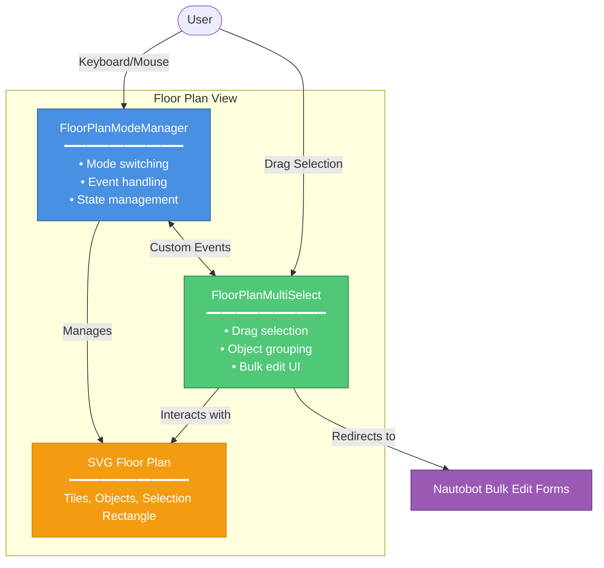

# Multi-Select API Documentation

This document provides technical documentation for the Floor Plan multi-select feature, including API references for the JavaScript classes and guidance for developers who want to extend or modify the functionality.

## Architecture Overview

The multi-select feature consists of two main JavaScript classes that work together:



### Component Interaction

1. **FloorPlanModeManager** manages the overall interaction mode (navigation vs selection)
    - Handles keyboard shortcuts (S key to toggle modes)
    - Manages pan/zoom navigation handlers
    - Dispatches `floorplan:modechange` events

2. **FloorPlanMultiSelect** handles selection logic and bulk edit UI
    - Listens for mode change events
    - Implements drag-to-select functionality
    - Groups selected objects by type
    - Shows adaptive bulk edit buttons based on permissions

3. **Communication** happens via custom events dispatched on the document
    - `floorplan:modechange` - Notifies when mode switches
    - `floorplan:svgloaded` - Notifies when SVG is ready

4. **SVG Floor Plan** is the shared DOM element both classes interact with
    - Contains tiles, objects, and selection rectangles
    - Receives mouse/keyboard events
    - Updates visual state based on selections

## FloorPlanModeManager API

The `FloorPlanModeManager` class manages switching between navigation and selection modes.

### Constructor

```javascript
new FloorPlanModeManager(svgElement, navigationHandlers, options)
```

**Parameters:**

- `svgElement` (SVGElement): The SVG element representing the floor plan
- `navigationHandlers` (Object): Object containing navigation event handlers
        - `onmousedown` (Function): Mouse down handler for pan/zoom
        - `onwheel` (Function): Mouse wheel handler for zoom
        - `onclick` (Function): Click handler for navigation
- `options` (Object, optional): Configuration options
        - `debug` (Boolean): Enable debug logging (default: false)

**Example:**

```javascript
const modeManager = new FloorPlanModeManager(
    document.querySelector('svg'),
    {
        onmousedown: handlePanStart,
        onwheel: handleZoom,
        onclick: handleClick
    },
    { debug: false }
);
```

### Methods

#### `toggleMode()`

Toggles between navigation and selection modes.

**Returns:** `void`

**Example:**

```javascript
modeManager.toggleMode();
```

#### `enableSelectionMode()`

Switches to selection mode, disabling navigation handlers.

**Returns:** `void`

**Side Effects:**

- Removes navigation event listeners
- Disables zoom/pan controls
- Updates button UI
- Dispatches `floorplan:modechange` event

**Example:**

```javascript
modeManager.enableSelectionMode();
```

#### `disableSelectionMode()`

Switches to navigation mode, re-enabling navigation handlers.

**Returns:** `void`

**Side Effects:**

- Restores navigation event listeners
- Enables zoom/pan controls
- Updates button UI
- Dispatches `floorplan:modechange` event

**Example:**

```javascript
modeManager.disableSelectionMode();
```

#### `getCurrentMode()`

Gets the current mode.

**Returns:** `string` - Either `'navigation'` or `'selection'`

**Example:**

```javascript
const currentMode = modeManager.getCurrentMode();
if (currentMode === 'selection') {
    // Do something in selection mode
}
```

#### `cleanup()`

Removes event listeners and cleans up resources.

**Returns:** `void`

**Example:**

```javascript
// When destroying the floor plan view
modeManager.cleanup();
```

### Events

#### `floorplan:modechange`

Dispatched when the mode changes.

**Event Detail:**

```javascript
{
    mode: 'navigation' | 'selection',
    previousMode: 'navigation' | 'selection'
}
```

**Example:**

```javascript
document.addEventListener('floorplan:modechange', (event) => {
    console.log(`Mode changed from ${event.detail.previousMode} to ${event.detail.mode}`);
});
```

## FloorPlanMultiSelect API

The `FloorPlanMultiSelect` class handles drag selection and bulk edit operations.

### Constructor

```javascript
new FloorPlanMultiSelect(svgElement, options)
```

**Parameters:**

- `svgElement` (SVGElement): The SVG element representing the floor plan
- `options` (Object, optional): Configuration options
        - `permissions` (Object): User permissions for bulk editing
        - `canEditRacks` (Boolean): Permission to bulk edit racks
        - `canEditDevices` (Boolean): Permission to bulk edit devices
        - `canEditPowerPanels` (Boolean): Permission to bulk edit power panels
        - `canEditPowerFeeds` (Boolean): Permission to bulk edit power feeds
        - `returnUrl` (String): URL to return to after bulk edit
        - `debug` (Boolean): Enable debug logging (default: false)

**Example:**

```javascript
const multiSelect = new FloorPlanMultiSelect(
    document.querySelector('svg'),
    {
        permissions: {
            canEditRacks: true,
            canEditDevices: true,
            canEditPowerPanels: false,
            canEditPowerFeeds: false
        },
        returnUrl: window.location.href,
        debug: false
    }
);
```

### Methods

#### `enable()`

Enables multi-select functionality.

**Returns:** `void`

**Side Effects:**

- Adds mouse event listeners for drag selection
- Changes cursor to crosshair

**Example:**

```javascript
multiSelect.enable();
```

#### `disable()`

Disables multi-select functionality.

**Returns:** `void`

**Side Effects:**

- Removes mouse event listeners
- Clears any active selection
- Restores default cursor

**Example:**

```javascript
multiSelect.disable();
```

#### `clearSelection()`

Clears the current selection.

**Returns:** `void`

**Side Effects:**

- Removes selection highlights from tiles
- Hides bulk edit UI
- Removes selection rectangle if present

**Example:**

```javascript
multiSelect.clearSelection();
```

#### `getSelectedObjectsByType()`

Gets selected objects grouped by type.

**Returns:** `Object` - Object with keys for each object type and arrays of PKs

```javascript
{
    rack: [1, 2, 3],
    device: [4, 5],
    power_panel: [],
    power_feed: []
}
```

**Example:**

```javascript
const selected = multiSelect.getSelectedObjectsByType();
console.log(`Selected ${selected.rack.length} racks and ${selected.device.length} devices`);
```

#### `submitBulkEditForType(objectType)`

Submits bulk edit form for a specific object type.

**Parameters:**

- `objectType` (String): One of `'rack'`, `'device'`, `'power_panel'`, `'power_feed'`

**Returns:** `void`

**Side Effects:**

- Creates and submits a form to Nautobot's bulk edit endpoint
- Stores return URL in localStorage
- Navigates to bulk edit page

**Example:**

```javascript
// Typically called internally, but can be called manually
multiSelect.submitBulkEditForType('rack');
```

### Internal Methods

These methods are used internally but documented for reference:

#### `handleMouseDown(event)`

Handles mouse down event to start drag selection.

#### `handleMouseMove(event)`

Handles mouse move event to update selection rectangle.

#### `handleMouseUp(event)`

Handles mouse up event to complete selection.

#### `createSelectionRectangle(x, y)`

Creates the visual selection rectangle SVG element.

#### `updateSelectionRectangle(x, y)`

Updates the selection rectangle dimensions during drag.

#### `finalizeSelection()`

Completes the selection and shows bulk edit UI.

#### `checkIntersection(tile, rect)`

Checks if a tile intersects with the selection rectangle.

#### `showBulkEditButtons(selectedByType)`

Shows appropriate bulk edit UI based on selected object types.

## Configuration

### Global Configuration

The multi-select feature can be configured via global JavaScript variables:

```javascript
// Set in the template
window.FLOOR_PLAN_PERMISSIONS = {
    canEditRacks: true,
    canEditDevices: true,
    canEditPowerPanels: true,
    canEditPowerFeeds: true
};

window.FLOOR_PLAN_RETURN_URL = "{{ request.path }}";
```

### Debug Mode

Enable debug logging for troubleshooting:

```javascript
const DEBUG = true; // Set at top of floorplan-multiselect.js
```

Debug mode logs:

- Mode changes
- Selection events
- Object grouping
- Permission checks
- Bulk edit submissions

## Extending the Feature

### Adding Support for New Object Types

To add support for a new object type (e.g., `circuit`):

1. **Update the selector in `FloorPlanMultiSelect`:**

```javascript
// In getSelectedObjectsByType()
const selectableElements = this.svg.querySelectorAll(
    'a[id^="rack-"], a[id^="device-"], a[id^="power_panel-"], ' +
    'a[id^="power_feed-"], a[id^="circuit-"]' // Add new type
);
```

2. **Add permission check:**

```javascript
// In constructor options
this.permissions = {
    // ... existing permissions
    canEditCircuits: options.permissions?.canEditCircuits || false
};
```

3. **Add bulk edit URL mapping:**

```javascript
// In submitBulkEditForType()
const bulkEditUrls = {
    // ... existing URLs
    circuit: '/dcim/circuits/edit/'
};
```

4. **Update button display logic:**

```javascript
// In showBulkEditButtons()
if (selectedByType.circuit && selectedByType.circuit.length > 0 &&
    this.permissions.canEditCircuits) {
    // Add button/dropdown option
}
```

### Customizing Selection Behavior

Override selection behavior by extending the class:

```javascript
class CustomMultiSelect extends FloorPlanMultiSelect {
    checkIntersection(tile, rect) {
        // Custom intersection logic
        // For example, require full containment instead of partial overlap
        const tileRect = tile.getBoundingClientRect();
        return (
            tileRect.left >= rect.left &&
            tileRect.right <= rect.right &&
            tileRect.top >= rect.top &&
            tileRect.bottom <= rect.bottom
        );
    }
}
```

### Custom Bulk Edit Actions

Add custom actions beyond standard bulk edit:

```javascript
class ExtendedMultiSelect extends FloorPlanMultiSelect {
    showBulkEditButtons(selectedByType) {
        super.showBulkEditButtons(selectedByType);

        // Add custom action button
        if (selectedByType.rack && selectedByType.rack.length > 0) {
            const customButton = document.createElement('button');
            customButton.textContent = 'Custom Action';
            customButton.onclick = () => this.performCustomAction(selectedByType.rack);
            // Add button to UI
        }
    }

    performCustomAction(rackIds) {
        // Custom logic here
        console.log('Performing custom action on racks:', rackIds);
    }
}
```

## Best Practices

### Performance

1. **Debounce selection updates** for large floor plans:

```javascript
let selectionTimeout;
handleMouseMove(event) {
    clearTimeout(selectionTimeout);
    selectionTimeout = setTimeout(() => {
        this.updateSelectionRectangle(event.clientX, event.clientY);
    }, 16); // ~60fps
}
```

2. **Use efficient selectors** - ID-based selectors are fastest

3. **Minimize DOM manipulation** - Batch updates when possible

### Error Handling

Always wrap bulk edit submissions in try-catch:

```javascript
try {
    this.submitBulkEditForType(objectType);
} catch (error) {
    console.error('Bulk edit submission failed:', error);
    alert('Failed to submit bulk edit. Please try again.');
}
```

### Testing

Test multi-select functionality:

```javascript
// Unit test example
describe('FloorPlanMultiSelect', () => {
    it('should group selected objects by type', () => {
        const multiSelect = new FloorPlanMultiSelect(mockSvg);
        // ... perform selection
        const grouped = multiSelect.getSelectedObjectsByType();
        expect(grouped.rack).toHaveLength(3);
        expect(grouped.device).toHaveLength(2);
    });
});
```

## Troubleshooting

### Selection Not Working

1. Check that selection mode is enabled
2. Verify SVG element is correctly passed to constructor
3. Check browser console for JavaScript errors
4. Enable debug mode to see event flow

### Bulk Edit Buttons Not Appearing

1. Verify user has appropriate permissions
2. Check that objects are actually selected
3. Verify permission object is correctly configured
4. Check browser console for permission-related logs

### Selection Rectangle Not Visible

1. Check CSS for `.selection-rectangle` class
2. Verify SVG namespace is correct
3. Check z-index/stacking order in SVG

## Additional Resources

- [Nautobot Bulk Edit Documentation](https://docs.nautobot.com/)
- [SVG Coordinate Systems](https://developer.mozilla.org/en-US/docs/Web/SVG/Tutorial/Positions)
- [JavaScript Custom Events](https://developer.mozilla.org/en-US/docs/Web/API/CustomEvent)
- [GSAP Animation Library](https://greensock.com/gsap/) (used for smooth animations)
