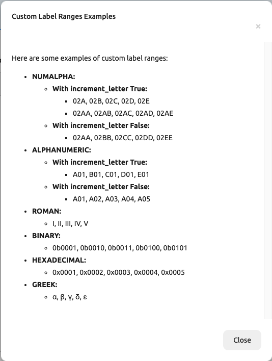
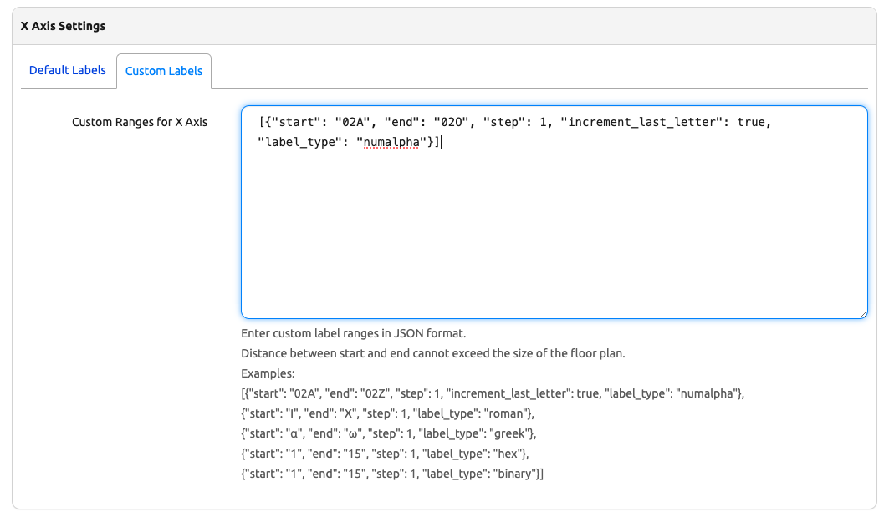
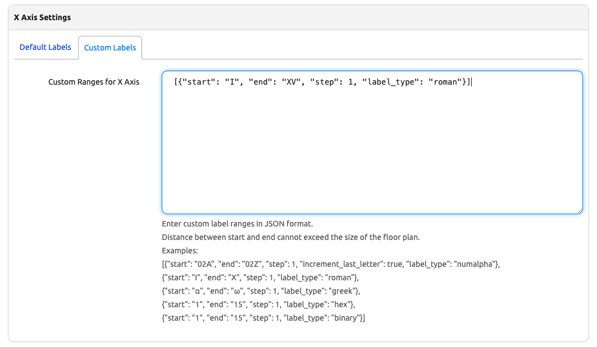

# Getting Started with the App

This document provides a step-by-step tutorial on how to get the app up and running, as well as instructions on how to use it effectively.

## Install the App

To install the app, please follow the instructions detailed in the [Installation Guide](../admin/install.md).

## First Steps with the App

### Defining Statuses for Floor Plan Tiles

The first step is to define which Status(es) can be applied to individual tiles in a floor plan. Navigate to **"Organization > Statuses"** in the Nautobot UI and create or update the desired Status records to include `nautobot_floor_plan | floor plan tile` as one of the Status's *Content Types*.

The app installs with the following statuses by default:
`"Active", "Reserved", "Decommissioning", "Unavailable", "Planned"`


## Next Steps

### Adding a Floor Plan to a Location

For any [Location](https://docs.nautobot.com/projects/core/en/stable/core-functionality/sites-and-racks/#locations) defined in your Nautobot instance, navigate to the **"detail"** view for that Location. A new **"Add Floor Plan"** button will be present.


Clicking this button will open a standard Nautobot create/edit form. This form allows you to define the parameters of the floor plan for the selected Location.

#### Floor Plan Parameters

- **X Size** and **Y Size**:
  Define the number of tiles in the floor plan.

- **Tile Width** and **Tile Depth**:
  Define the relative proportions of each tile when rendered in the Nautobot UI.
    - You can use the default settings for a square grid.
    - Alternatively, customize these parameters for a rectangular grid.

- **Movable Tiles**:
  Determine if you want tiles to be movable once placed.
    - This feature is a optional setting to assist with Custom Label creation
    - Default: `"True"`


#### Axis Labeling and Configuration

Default settings allow you to configure labels, seeds, and steps for each axis of the floor plan.

- **X Axis Settings** and **Y Axis Settings**:
  These parameters are divided into panels with tabs for *default* or *custom* labels.

- **X Axis Labels** and **Y Axis Labels**:
  Represent grid labels as either `"Numbers"` or `"Letters"`.
  - Default: `"Numbers"`

- **X Axis Seed** and **Y Axis Seed**:
  Define the starting point for grid labels.
  - Default: `"1"`

- **X Axis Step** and **Y Axis Step**:
  Set a positive or negative integer step value to skip numbers or letters in grid labeling.
  - Default: `"1"`


The **Custom Labels** tab provides options to configure a custom label range using the following parameters: `start`, `end`, `step`, `increment_letter`, and `label_type`.





## Parameters

- **`start`**
  Similar to the default seed parameters, `start` specifies the starting point for the custom label range.

- **`end`**
  Specifies the last label in the custom range.

- **`step`**
  This works like the default *X Axis Step* and *Y Axis Step* parameters, allowing you to set a positive or negative integer to control label spacing within the grid.
  The default value is `1`.

- **`increment_letter`** *(optional)*
  Applicable only for *numalpha* and *alphanumeric* label types, this parameter controls whether letter patterns increment.
  - *Default*: `true`
  - When set to `true`:
  - The letter portions increment,  but the numeric portions do not creating patterns like:
    - For numalpha: `02AA, 02AB, 02AC`
    - For alphanumeric: `A01, B01, C01`
  - When set to `false`:
  - For numalpha:
    - The entire letter portion increments with every step creating patterns like:
    - `02AA, 02BB, 02CC`
  - For alphanumeric:
    - The letter prefix does not increment, but the numeric portion does creating patterns like:
    - `A01, A02, A03`

  Both *numalpha* and *alphanumeric* label types support leading or non-leading zero formats.

- **`label_type`**
  Specifies the type of label. Supported types include:
  - `numalpha`
  - `alphanumeric`
  - `roman`
  - `greek`
  - `hex`
  - `binary`
  - `letters`
  - `numbers`

!!! note
    The total range of configured labels must not exceed the configured *X Size* or *Y Size* of the floor plan for their respective axis.

## Configuration Examples

### Single Range Example

With an X Size of 10:

```json
[{"start": "02A", "end": "02J", "step": 1, "increment_letter": true, "label_type": "numalpha"}]
```

```json
[{"start": "I", "end": "X", "step": 1, "label_type": "roman"}]
```

### Multiple Range Example

With an X Size of 10:

```json
[{"start": "02A", "end": "02E", "step": 1, "increment_letter": true, "label_type": "numalpha"},{"start": "02AA", "end": "02EE", "step": 1, "increment_letter": false, "label_type": "numalpha"}]
```

```json
[{"start": "1", "end": "5", "step": 1, "label_type": "binary"},{"start": "11", "end": "15", "step": 1, "label_type": "binary"}]
```

## Creating and Managing the Floor Plan

After clicking **Create**, you will be presented with a newly rendered floor plan:


!!! note
    This view will be accessible again in the future by navigating to the Location's **detail** view and clicking the **Floor Plan** tab.

### Tile management on the Floor Plan

To edit information on a tile, either click the:
* Yellow pencil button in the upper left to edit it.
* Box within the tile to view the existing rack assigned.
* Green **"+"** icon in the center of any rectangle in the grid.
* The blue **"+ Add Tile"** button in the upper right of the floor plan.


### Floorplan Navigation

If you've defined a large floor plan or have a small display, you can use your mouse wheel to zoom in for a better view. While zoomed in, click and drag to pan around the grid.

### Tile Options

For each tile, you can:

- **Assign a Status**: Choose from the predefined Statuses (e.g., "Active", "Reserved").
- **Assign a Rack or RackGroup**: Specify the rack or rack group associated with the tile.
- **Specify Rack Orientation**: Define the orientation of the rack relative to the floor plan.
- **Adjust Tile Size**: Expand a tile to cover multiple spaces.
  - Useful for documenting larger-than-usual racks or marking sections of the floor plan as "Reserved" or "Unavailable."

!!! note
    Once a Rack has been placed on a **Floor Plan Tile** you cannot update the **Location** of the Rack until it has been removed from the Floor Plan or the Floor Plan has been deleted.

### Working with RackGroup and Status Tiles

When tiles cover multiple spaces:

- You can place racks within these tiles.
- For RackGroup tiles, racks must be added to the appropriate RackGroup.
- Tile size can be increased or decreased, as long as they do not overlap with other tiles.

### Additional Tile Information

When a rack is assigned to a tile, the display of the tile will also include:

- **Tenant Information**: The tenant and tenant group associated with the rack.


### Resizing the Floor Plan

Once tiles have been added, the floor plan can no longer be resized.

- This restriction prevents resizing that could place tiles outside the new dimensions.
- To change the floor plan's dimensions, you must: Remove all tiles, or Delete and recreate the floor plan.
