# Getting Started with the App

This document provides a step-by-step tutorial on how to get the app up and running, as well as instructions on how to use it effectively.

## Install the App

To install the app, please follow the instructions detailed in the [Installation Guide](../admin/install.md).

## First Steps with the App

### Defining Statuses for Floor Plan Tiles

The first step is to define which Status(es) can be applied to individual tiles in a floor plan. Navigate to **"Organization > Statuses"** in the Nautobot UI and create or update the desired Status records to include `nautobot_floor_plan | floor plan tile` as one of the Status's *Content Types*.

The app installs with the following statuses by default:
`"Active", "Reserved", "Decommissioning", "Unavailable", "Planned"`

## Next Steps

### Adding a Floor Plan to a Location

For any [Location](https://docs.nautobot.com/projects/core/en/stable/core-functionality/sites-and-racks/#locations) defined in your Nautobot instance, navigate to the **"detail"** view for that Location. A new **"Add Floor Plan"** button will be present.

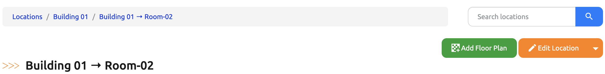

Clicking this button will open a standard Nautobot create/edit form. This form allows you to define the parameters of the floor plan for the selected Location.

#### Floor Plan Parameters

- **X Size** and **Y Size**:
  Define the number of tiles in the floor plan.

- **Tile Width** and **Tile Depth**:
  Define the relative proportions of each tile when rendered in the Nautobot UI.
    - You can use the default settings for a square grid.
    - Alternatively, customize these parameters for a rectangular grid.

- **Movable Tiles**:
  Determine if you want tiles to be movable once placed.
    - This feature is a optional setting to assist with Custom Label creation
    - Default: `"True"`

#### Axis Labeling and Configuration

Default settings allow you to configure labels, seeds, and steps for each axis of the floor plan.

- **X Axis Settings** and **Y Axis Settings**:
  These parameters are divided into panels with tabs for *default* or *custom* labels.

- **X Axis Labels** and **Y Axis Labels**:
  Represent grid labels as either `"Numbers"` or `"Letters"`.
  - Default: `"Numbers"`

- **X Axis Seed** and **Y Axis Seed**:
  Define the starting point for grid labels.
  - Default: `"1"`

- **X Axis Step** and **Y Axis Step**:
  Set a positive or negative integer step value to skip numbers or letters in grid labeling.
  - Default: `"1"`

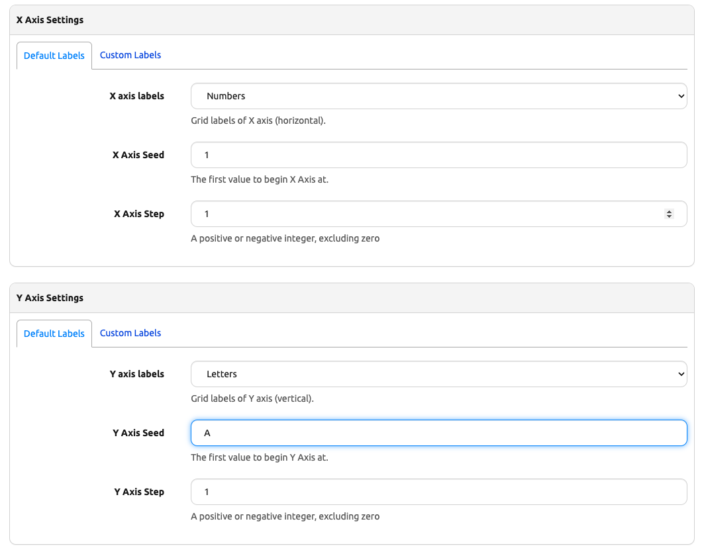

The **Custom Labels** tab provides options to configure a custom label range using the following parameters: `start`, `end`, `step`, `increment_letter`, and `label_type`.

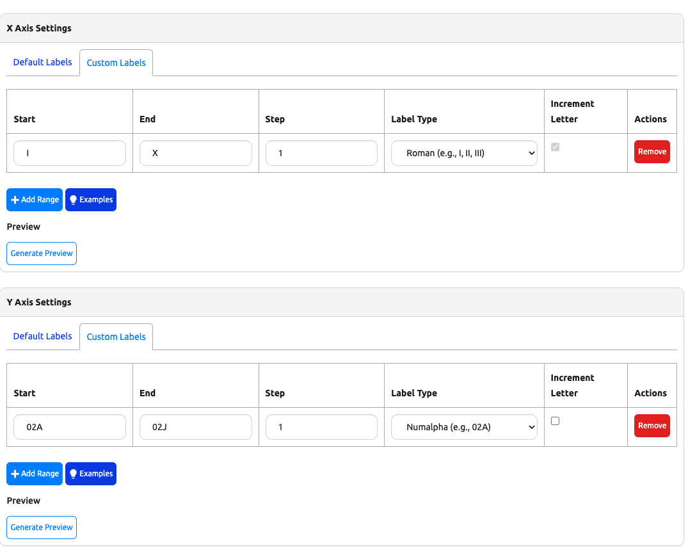

## Parameters

- **`start`**
  Similar to the default seed parameters, `start` specifies the starting point for the custom label range.

- **`end`**
  Specifies the last label in the custom range.

- **`step`**
  This works like the default *X Axis Step* and *Y Axis Step* parameters, allowing you to set a positive or negative integer to control label spacing within the grid.
  The default value is `1`.

- **`increment_letter`** *(optional)*
  Applicable only for *numalpha* and *alphanumeric* label types, this parameter controls whether letter patterns increment.
  - *Default*: `true`
  - When set to `true`:
  - The letter portions increment,  but the numeric portions do not creating patterns like:
    - For numalpha: `02AA, 02AB, 02AC`
    - For alphanumeric: `A01, B01, C01`
  - When set to `false`:
  - For numalpha:
    - The entire letter portion increments with every step creating patterns like:
    - `02AA, 02BB, 02CC`
  - For alphanumeric:
    - The letter prefix does not increment, but the numeric portion does creating patterns like:
    - `A01, A02, A03`

  Both *numalpha* and *alphanumeric* label types support leading or non-leading zero formats.

- **`label_type`**  
  Specifies the type of label. Supported types include:  
  - `numalpha (e.g., 02A, 05ZZ, 04AZ)`  
  - `alphanumeric (e.g., A01, B02)`  
  - `roman (e.g., I, II, III)`  
  - `greek (e.g., α, β, γ)`  
  - `hex (e.g., 0x0001, 0x000A, 0x000F)`  
  - `binary (e.g., 0b0001, 0b1010, 0b0110)`  
  - `letters (e.g., A, B, C)`  
  - `numbers (e.g. 1, 2, 3)`

There is a `Generate Preview` button that allows you to preview a range of labels that would be generated on the grid once the Floor Plan form has been saved.

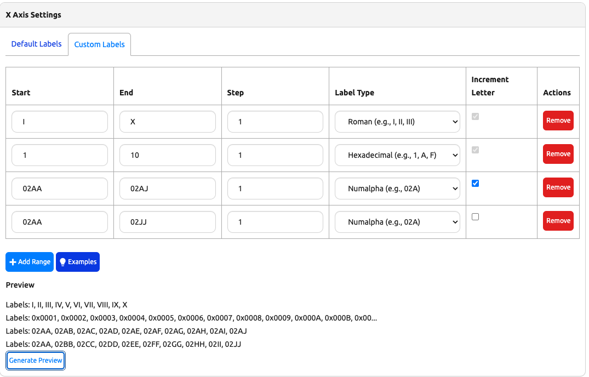

!!! note
    The total range of configured labels must not exceed the configured *X Size* or *Y Size* of the floor plan for their respective axis.

## Configuration Examples

### Single Range Example

With an X Size of 10:

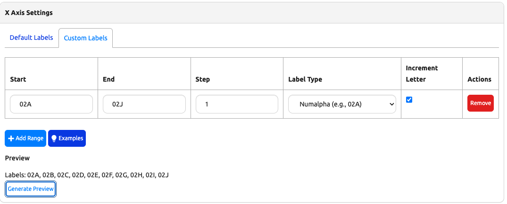

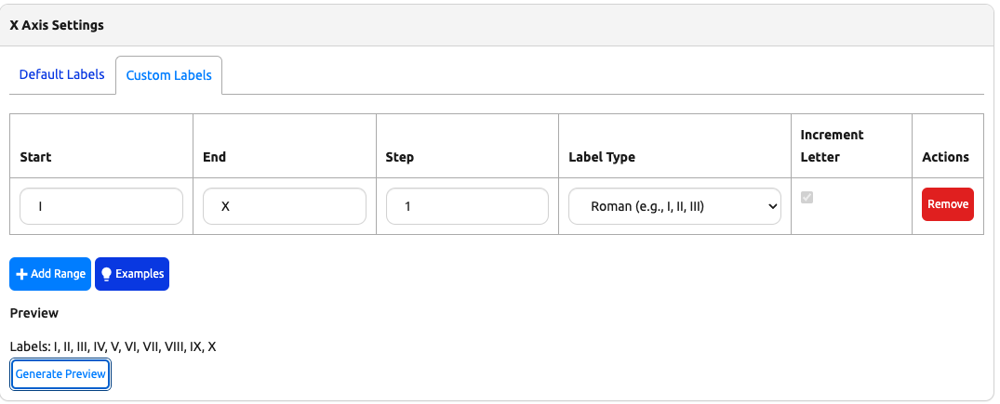

### Multiple Range Example

With an X Size of 10:

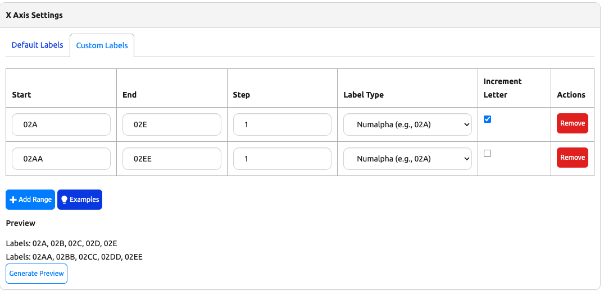

## Creating and Managing the Floor Plan

After clicking **Create**, you will be presented with a newly rendered floor plan:

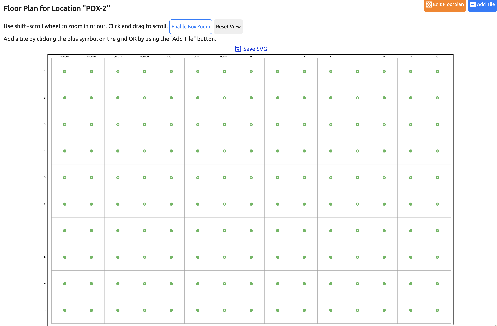

!!! note
    This view will be accessible again in the future by navigating to the Location's **detail** view and clicking the **Floor Plan** tab.

### Tile management on the Floor Plan

To add a tile, either click the:

- Green **"+"** icon in the center of any rectangle in the grid.
- The blue **"+ Add Tile"** button in the upper right of the floor plan.

To edit information on a tile, either click the:

- Yellow pencil button in the upper left to edit it.
- Box within the tile to view the existing object assigned.

### Tile Options

For each tile, you can:

- **Assign a Status**: Choose from the predefined Statuses (e.g., "Active", "Reserved").
- **Assign a Object or RackGroup**: Specify the object or rack group associated with the tile.
- **Specify Rack Orientation**: Define the orientation of the object relative to the floor plan.
- **Adjust Tile Size**: Expand a tile to cover multiple spaces.
  - Useful for documenting larger-than-usual racks or marking sections of the floor plan as "Reserved" or "Unavailable."

!!! note
    Once a Object (Device, Power Panel, Power Feed, or Rack) has been placed on a **Floor Plan Tile** you cannot update the **Location** of the Object until it has been removed from the Floor Plan or the Floor Plan has been deleted.

### Working with RackGroup and Status Tiles

Device, Power Panels, Power Feeds and Racks can be assigned directly to tiles using the Floor plan tile form.

When tiles cover multiple spaces:

- You can place objects within these tiles.
- For RackGroup tiles, objects must be added to the appropriate RackGroup before they can be placed on a tile.
- Tile size can be increased or decreased, as long as they do not overlap with other tiles.

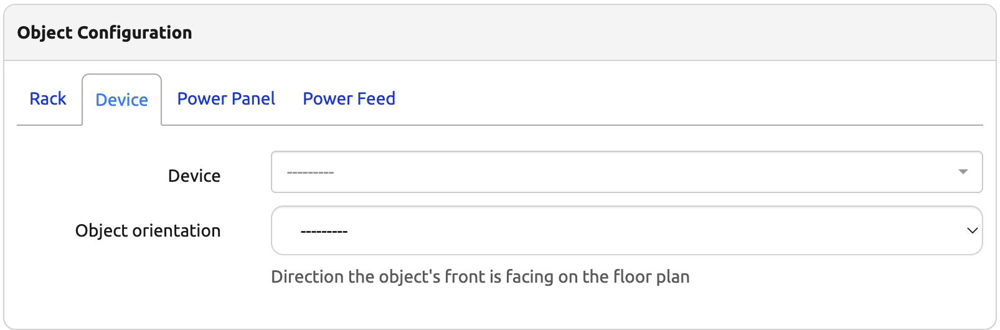

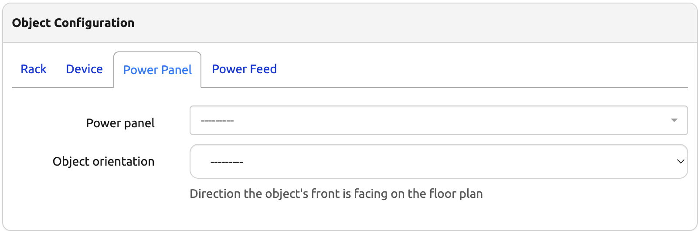

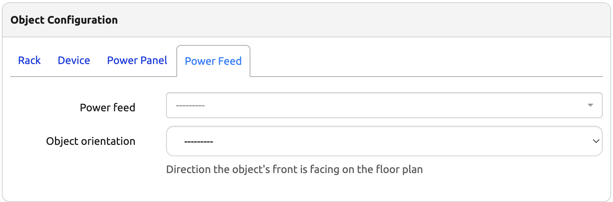

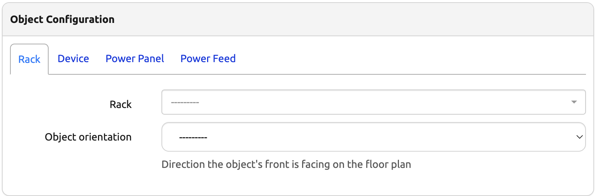

### Additional Tile Information

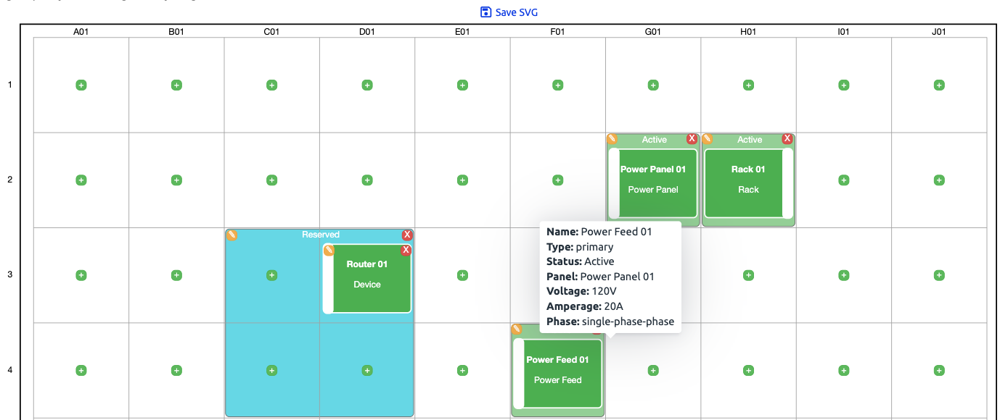

When a object is assigned to a tile, the display of the tile includes:

- **Name**: The name of the object.
- **Type**: The type of the object.

Hovering your mouse over a tile will render a tooltip that will display specific information about the object.

Device:

- **Manufacturer**: The manufacturer of the device object.
- **Model**: The model of the Device object.
- **Serial**: The serial number of the device if there is one configured.

Power Panel:

- **Feeds**: The name of the feeds if any are connected to the panel.
- **RackGroup**: Assigned RackGroup if there is one assigned to the panel.

Power Feed:

- **Panel**: The name of the Power Feed.
- **Voltage**: The Voltage assigned to the PFeed.
- **Amperage**: The Amperage assigned to the Feed.
- **Phase**: The Phase of the Phase (single or three)

Rack:

- **Utilization**: The total utilization of the Rack. ie. 7/42 RU
- **RackGroup**: Assigned RackGroup if there is one assigned to the rack.

Common Data:

- **Name**: The name of the object.
- **Type**: The type of the object.
- **Status**: The status of the object.
- **Tenant**: Assigned tenant for the object if one is assigned.
- **TenantGroup**: Assigned TenantGroup for the object if one is assigned.

### Floorplan Navigation

If you've defined a large floor plan or have a small display, you can use your mouse wheel to zoom in for a better view. While zoomed in, click and drag to pan around the grid.

Additional you can use the Enable Box Zoom/Switch to Pan Mode button to left click and drag a zoom box while Zoom is enabled, or pan in any direction when the Pan is enable. The Reset View button will reset the view back to the original rendered floor plan.

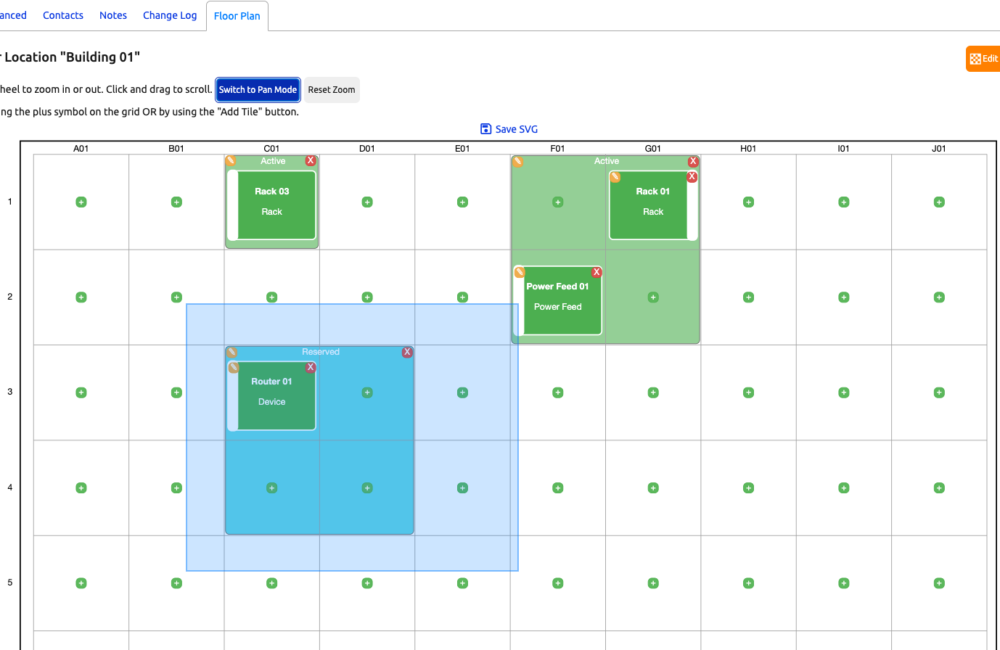
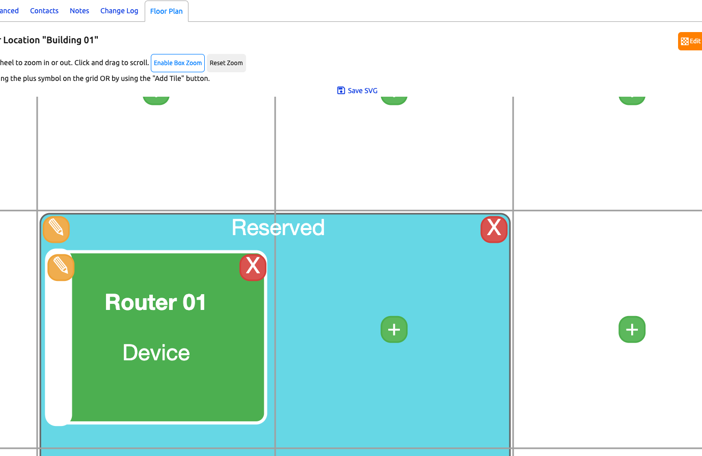

### Resizing the Floor Plan

Once tiles have been added, the floor plan can no longer be resized.

- This restriction prevents resizing that could place tiles outside the new dimensions.
- To change the floor plan's dimensions, you must: Remove all tiles, or Delete and recreate the floor plan.
